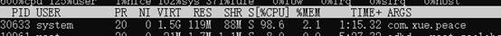
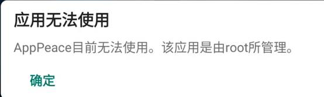

# AppPeace

## 概述安卓禁止应用运行的一些机制

安卓里禁止应用启动的机制有：

·     **停用应用**： pm disable-user com.xx.xxxx、pm disable-until-used com.xx.xxx, disable-until-used是某些条件下解决，比如某些手机输入法默认一开始disable，在第一次使用输入法时自动变成enable。但是触发条件不明确目前只知道输入法和admin。“startAcrtivity不会触发自动解disable”。

·     **隐藏应用**：使用pm hide命令，保留数据，但是应用无法启动，就仿佛已经卸载了。

·     **暂停应用**（仅限Android 7.0+）：通过PMS的setPackagesSuspended方法阻止应用通知、启动活动和声音。这种方式应用的Service还是可以启动的，但是Activity不能运行，在ActivityStartInterceptor的interceptSuspendedPackageIfNeeded 方法里拦截了。

  

setPackagesSuspended 是 PackageManager 的一个 public 方法，它可以用来暂停应用。
 应用被暂停之后会进入 Suspended 状态，无法点击打开，会弹出一个系统对话框，提示应用已被暂停。

setPackagesSuspended 通过 PMS 改变 ApplicationInfo 的 FLAG_SUSPENDED 标记和发送 ACTION_PACKAGES_SUSPENDED、ACTION_MY_PACKAGE_SUSPENDED 通知其他服务（AMS 等）实现应用暂停的效果。

FWK 中的其他地方判断一个应用是否被暂停了就是依靠这个 ApplicationInfo.FLAG_SUSPENDED 标记。比如Activity启动拦截器ActivityStartInterceptor，

 启动拦截的 interceptSuspendedPackageIfNeeded 方法

```java
// 如果有FLAG_SUSPENDED标志，就拦截不让启动
if (mAInfo == null || mAInfo.applicationInfo == null ||
      (mAInfo.applicationInfo.flags & FLAG_SUSPENDED) == 0) {
     return false;
}
```


 

只禁用应用里的组件：

Package Manager提供一个`setComponentEnabledSetting(ComponentName, int, int)`的接口，有signature等级或root权限可以对第三方应用进行操控。

```
pm disable [PackageName/ComponmentName]
```

应用组件状态变化最终写入`/data/system/users/0/package_restrictions.xml`文件下

 

Intent Firewall（IFW， 意图防火墙）自Android 4.4.2(API 19)版本后被引入。Google 没有提供官方 API 和文档来描述此功能，所以目前 IFW 是一个 Undocumented 的功能，它可能随时被更改。

Intent Firewall用于过滤应用程序的启动意图(Intent)。防火墙的过滤列表定义在`/data/system/ifw/` 中的 XML 规则文件当中，当文件发生变化，防火墙会即时更新过滤规则。

需要System权限。

**基础格式**

```xml
<rules>

 <[component] block="[true/false]" log="[true/false]" >

  <intent-filter >

   <action name="[action]" />

  </intent-filter>

 </[component]>

</rules>
```


注意 IFW 只解析` <rules />` 标签下的` <activity /> <service /> <broadcast />` 标签


位于ActivityStarter.java startActivity 函数。

```
if (mInterceptor.intercept(intent, rInfo, aInfo, resolvedType, inTask, callingPid,
749                  callingUid, checkedOptions)) {
750              // activity start was intercepted, e.g. because the target user is currently in quiet
751              // mode (turn off work) or the target application is suspended
752              intent = mInterceptor.mIntent;
753              rInfo = mInterceptor.mRInfo;
754              aInfo = mInterceptor.mAInfo;
755              resolvedType = mInterceptor.mResolvedType;
756              inTask = mInterceptor.mInTask;
757              callingPid = mInterceptor.mCallingPid;
758              callingUid = mInterceptor.mCallingUid;
759              checkedOptions = mInterceptor.mActivityOptions;
760          }
761  
```

 

 

setPackagesSuspended研究

命令：pm suspend com.xue.peace

应用并没有停止：



 

然后am start -n com.xue.peace/.MainActivity

已经无法启动。



 

查看状态：

dumpsys package com.xue.peace | grep suspend

 

解除

pm unsuspend com.xue.peace
